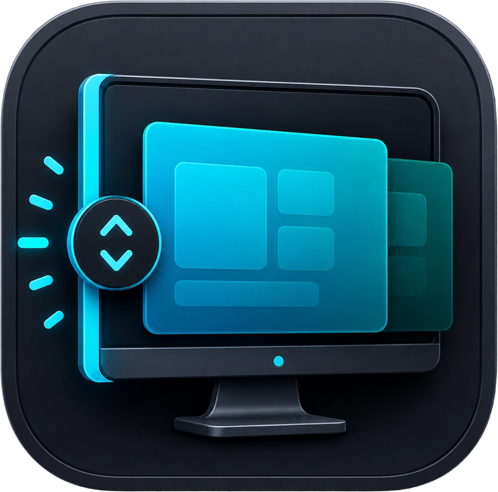

# desktop-switcher

<p align="center">
  
</p>

一个 Windows 虚拟桌面快捷切换工具。

当前版本通过屏幕左边缘触发：把鼠标移动到屏幕左边缘后使用滚轮。

## 功能

- 启动后只显示一个系统托盘图标，不显示主窗口或控制台窗口。
- 托盘图标使用内嵌的应用图标资源，不依赖运行目录下的图片文件。
- 鼠标位于屏幕左边缘 `4px` 触发区内时，监听滚轮操作和滚轮按下操作。
- 滚轮向上：切换到左侧虚拟桌面。
- 滚轮向下：切换到右侧虚拟桌面。
- 按下滚轮：打开 Windows 多任务视图。
- 支持多显示器：按鼠标当前所在显示器的左边缘判断。
- 左边缘触发区处理的滚轮事件和滚轮按下事件会被拦截，避免同时影响当前窗口。
- 托盘图标右键菜单提供“边缘滚轮切换”、“开机自启”和“退出”。
- “边缘滚轮切换”的启用状态会保存到可执行文件同目录下的配置文件。

## 技术实现

项目使用 Rust 编写，通过 `windows` crate 调用 Win32 API：

- `SetWindowsHookExW` + `WH_MOUSE_LL`：注册全局低级鼠标钩子。
- `WM_MOUSEWHEEL`：捕获全局滚轮事件。
- `WM_MBUTTONDOWN`：捕获全局滚轮按下事件。
- `MonitorFromPoint` + `GetMonitorInfoW`：判断鼠标是否位于当前显示器左边缘。
- `SendInput`：模拟 Windows 虚拟桌面快捷键。
- `Shell_NotifyIconW`：注册系统托盘图标。
- `HKCU\Software\Microsoft\Windows\CurrentVersion\Run`：保存当前用户的开机自启设置。
- `config.toml`：保存功能开关状态，文件位于可执行文件同目录。

桌面切换目前通过模拟系统快捷键实现：

- `Ctrl + Win + Left`
- `Ctrl + Win + Right`

多任务视图通过模拟系统快捷键实现：

- `Win + Tab`

## 使用

运行：

```powershell
cargo run
```

启动后程序进入后台，只显示系统托盘图标。然后：

使用左边缘触发：

1. 把鼠标移动到屏幕最左边缘。
2. 滚动鼠标滚轮。
3. 或按下滚轮打开多任务视图。

边缘滚轮切换：

1. 右键点击系统托盘图标。
2. 点击“边缘滚轮切换”切换启用状态。
3. 菜单项带勾时表示已启用；取消勾选时会暂停左边缘滚轮和滚轮按下处理。

配置文件：

程序启动时会读取可执行文件同目录下的 `config.toml`。如果文件不存在，会按默认值创建：

```toml
edge_wheel_switching_enabled = true
```

托盘菜单中切换“边缘滚轮切换”时，会同步写回这个文件。

退出：

1. 右键点击系统托盘图标。
2. 点击“退出”。

开机自启：

1. 右键点击系统托盘图标。
2. 点击“开机自启”切换启用状态。
3. 菜单项带勾时表示已启用。

## 构建

```powershell
cargo build --release
```

构建产物位于：

```text
target/release/desktop-switcher.exe
```

## 当前限制

- 触发边缘宽度和触发边缘还没有配置文件。
- 配置文件只保存边缘滚轮切换状态；开机自启仍然保存在当前用户注册表中。
- 虚拟桌面切换依赖 Windows 默认快捷键，而不是直接调用虚拟桌面内部 COM API。

## 开发

常用检查命令：

```powershell
cargo fmt --check
cargo build
cargo clippy --all-targets --all-features -- -D warnings
```

## 代码结构

```text
src/
  main.rs             程序入口
  app.rs              应用运行期装配
  error_dialog.rs     错误消息弹窗
  tray.rs             隐藏消息窗口和系统托盘图标
  config.rs           可执行文件同目录配置文件读写
  startup.rs          当前用户开机自启注册表设置
  mouse_hook.rs       全局鼠标钩子、滚轮和滚轮按下处理
  screen_edge.rs      屏幕边缘检测
  desktop_switch.rs   虚拟桌面切换快捷键模拟
```

## 许可证

本项目基于 MIT License 开源。
